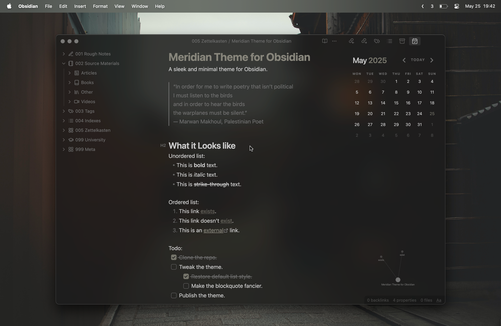

# 🌅 Meridian

A sleek and minimal theme for [Obsidian](https://obsidian.md).

The font shown in the screenshot is [Atkinson Hyperlegible](https://fonts.google.com/specimen/Atkinson+Hyperlegible), but the theme uses whatever font and font size you've set in your Obsidian settings.

For a more refined typographic feel, you can optionally use the [Lora](https://fonts.google.com/specimen/Lora) font for your headers with the [header-font-lora.css](https://github.com/mvahaste/meridian/blob/master/header-font-lora.css) snippet.

## Issues & Feature Requests

If you've encountered any issues or have any feature requests feel free to [create an issue](https://github.com/mvahaste/meridian/issues/new/choose) or [open a pull request](https://github.com/mvahaste/meridian/compare).

## Development Guide

1. Fork or clone this repository.
2. Create a `.env` file in the root directory of the repository with `.env.example` as a template.
3. Run `npm install` to install all dependencies
4. Run `npm start` to compile the theme into your Obsidian themes directory and watch for changes.

## Acknowledgements

- Forked from the [Apex](https://github.com/clearlysid/apex) theme.
